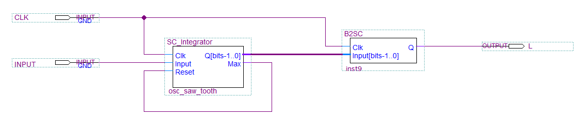

# Stochastic computing

[Stochastic computing](https://en.wikipedia.org/wiki/Stochastic_computing) is a technique for performing numerical computation on streams of random bits, unlike conventional computation that operates on multi-byte integers or floats.
In a stochastic bit stream a value is encoded as a frequency of ocurrence of the bit `1`. Such a bit stream when averaged renders the original value. In this sence stochastic encoding is somewhat similar to a [pulse width modulation (PWM)](https://en.wikipedia.org/wiki/Pulse-width_modulation) or a [pulse density modulation (PDM)](https://en.wikipedia.org/wiki/Pulse-density_modulation).
For the computations to work properly the bit streams must be truly stochastic (i.e. they are not correlated with each other or self-correlated). This also means that PWM and PDM modulations cannot be used to perform stochastic computation.

Stochastic computing re-emerged recently as an efficient technique to implement neural networks in hardware.

### Stochastic operations

A stochastic bit-stream can be interpreset as unipolar `[0..1]` range or bipolar `[-1..1]` range. Because in both cases the state of a signal line is either `0` or `1`, we have to state explicitly whether the signal is unipolar or bipolar. Also `up` and `down` terms are commonly used to represent a signal state (instead of `0` and `1`) to avoid confusion.

For audio applications we are interested in bipolar signals mostly. Such signal encodes `-1` as a stream of `0` bits (or `down`). `1` is encoded as continuous stream of `1` bits (or `up`). `0` line is encoded as fluctuating `up` and `down` states with 50% probability.

#### Unipolar multiplier
In stochastic compilting unipolar multiplier is a bitwise `and` operation:


#### Bipolar multiplier
Bipolar multiplier is a`xnor` operator:


#### Unipolar and bipolar adder
Adding to stochastic signals is more complex and involves a multiplexer. It is appicable to both unipolar and bipolar signals:


Depending on the state of the P bit (which is a stochastic stream as well) the multiplexer passes either `A` input to `C` or `B` input to `C` output. `P` stream defines a probability for input `A` to be passed to `C` vs input `B`. This results in a weighted sum:
```
C = P * A + (1 - P) * B
```
Which is for `P=0.5`:
```
C = 0.5 * (A + B)
```
This may be somewhat inconvinient if we want to sum signals without reducing the output. There is a way to scale up the output signal using gain operator.

#### Bipolar sign change
Chanding sign of a stochastic bipolar stream is just a `not` operation:


## Generating stochastic streams
We will need to generate stochastic streams with a given probability `P`. We can achieve this by using a uniform distribution random numbers generator. Comparing its output against the defined probability level we output `1` is the random number is below the level, and `0` if it is above the level `P`.

To generate random numbers on FPGA we can use [Linear Feedback Shift Register (LFSR)](https://en.wikipedia.org/wiki/Linear-feedback_shift_register) which is very easy to implement. The output from LFSR is quite stochastic in a sence that is has very low self-correlation and produces wide uniform spectrum:


> In order to avoid weird effects we must make sure the signals generated do not correlate. For this whenever an LFSR generator is used it must be given a different seed.

## A saw-tooth oscillator
A simpliest oscillator we can make is a saw-tooth. We make it by using an integrator that counts incoming `1`s from its stochastic input. The binary counter values is then used to generate stochastic output stream:



Upon saturation the integrator outputs `1` to its `Max` output, which is wired back into integrator's `Reset` input. This will reset the counter back to zero once it reaches its maximal value.

Here the integrator is 16-bits counter and the clock frequency is 100Mhz. This gives us the highest possible frequency of this oscillator of 1525.87891Hz. If we want to go higher we need to either increase the master clock frequency or reduce the width of the counter (for example 14-bits counter lets us generate sawtooth of up to 6.1kHz). But because a saw-tooth has many high frequency harmonics, 1.5kHz limit for the fundamental frequency is fine.

For the input set to 18898 and CLK=100Mhz, the generated sawtooth id ~440Hz:
```
f[Hz] = INPUT * 100*10^6[Hz] / 65536 / 65536
```

### Stochastic stream to audio output
Stochastic signals produced here are clocked at 100Mhz. This is very high sampling rate for audio, but the dynamic range is 1 bit only. We can convert it directly to an analog audio signal by passing via a simple RC low pass filter, like the one used to filter out PWM signals:


Here is that sawtooth audio


> :speaker: [sawtooth_440Hz](audio/sawtooth_440Hz.wav)

This is of course not very integersting, and there is nothing really about stochastic computing in there.

Lets try to apply binary `OR` operator on stochastic signal and slightly delayed version of itself:


Here we use 128-bits delay line (shift register) in order to avoid correlation issues (LFSR sequence correlates highly around 0 delay but correlation goes fast to zero with just a few bits offset).

The produced sawtooth will look now like this:


Apparently the `OR` operator computes the following formula when applied to the same unipolar input:
```
y = 1 - (x - 1)^2
```

We can also try the `AND` gate here:


As we know the `AND` operation is equivalent to unipolar multiplication. So when applied to the same signal (but decoirrelated of course - using delay in our case) it should square the input signal then, and it does!


So this is quite cool, because multiplications are expensive to synthesize in FPGAs, but here we just use simple gates.

Ok, another one. `XNOR` performs bipolar multiplication. So if we consider our sawtooth to be bipolar changing within `[-1..1]` range we'll get both branches of the `x^2` function:


> :speaker: [sawtooth_bipolar_squared_440Hz](audio/sawtooth_bipolar_squared_440Hz.wav)

This sounds close to a triangular wave.

By combining some circuitry we can obtain various interesting signals, for example


> In this particular case the input frequency must be doubled to ~37796 to get 440Hz output.

Now by replacing the one way integrator counter with a reversable integrator which integrates from 19195 to 65535 and then down to 19195, we can use the `OR` gate function `1 - (1 - x)^2` to approximate a sinewave:


> :speaker: [sine_approximation_440Hz](audio/sine_approximation_440Hz.wav)

> Value 19195 comes from the fact that we need a bipolar signal to flip its sign after one period. And because the integrator is unipolar, we need the `1 - (1 - x)^2` function to start from `0.5` which is bipolar zero, so
> 0.5 = 1 - (1 - x0)^2
> which gives x0 = 0.29289,
> or ~19195 in [0..65535] 16-bit integer range.
> Also because now we integrate from 19195 to 65535, the integrated value must be adjusted as well to keep the output at 440Hz.
