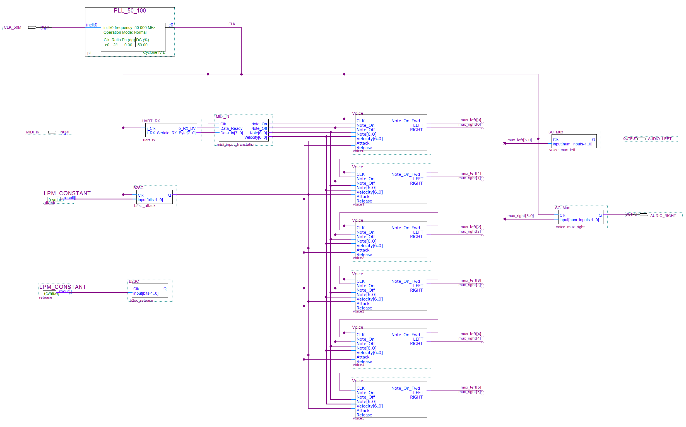

# Synthesizer architecture

## Top level

`UART_RX` serial receiver (from https://www.nandland.com/vhdl/modules/module-uart-serial-port-rs232.html) receives MIDI data and passes it to `MIDI_IN` block that decoded note on and off events, along with the note number and velocity (which is currently not used).

`Note_On` and `Note_Off` pulses that last for single clock are passed to the `Voice` blocks. `Note_On` is connected to the very first voice block only. All other voices are daisy-chained via `Note_On_Fwd` to `Note_On` links. When a voice is busy (i.e. it's been triggered and is currently playing) it forwards the `Note_On` signal to its `Note_On_Fwd` output. This way multiple voices can be triggered acheiving the polyphony.

Stochastic outputs from the voices are then mixed together via `SC_Mux` stochastic multiplexers/adders for left and right channels.

## Voice

A single voice is composed of three sawtooth stochastic oscillators, which produde stereo output each. The ferqiencies for the oscillators are provides by the `MIDI_Note2Freq` block, which is a look-up table that translates MIDI note number to frequency value for current design (100MHz clock 16-bits counters). Three frequencies produced are slightly detuned for each of the three oscillators.

The `Voice_Trigger` block received `Note_On` and `Note_Off` signals and transforms then into `Trigger` output which stays at `1` when voice has been triggered and playing, and goes to `0` on note off. In case of the `Busy` input being active the voice is not triggered, but the `Note_On` gets passed to `Forward` output.

Triggering the voice starts the envelope generator `Voice_Envelope`, which is a stochastic integrator integrating up until saturation (attack phase), and then down to bipolar stochastic zero (or 0.5 unipolar) on trigger input going down.

Outputs from the three oscillators are mixed together and the results are multiplied with the envelope's output using stochastic bipolar multiplier (`XNOR` gate).

## Sawtooth oscillator

A single oscillator is composed to two identical chains for setero output.
The first `B2SC` block turns the input frequency (16 bit unsigned integer) to an equivalent stochastic signal, which is then gets integrated by `SC_Integrator`. Upon saturation the integrators gets reset, thus producing a sawtooth output. The binary output from the integrator is then converted to stochastic signal and shaped with the `SC_Self_OR` block, which perform `OR` operation on the signal and its slightly delayed version. This gives concave shape to the sawtooth signal produced (`1 - (1 - x)^2` function).