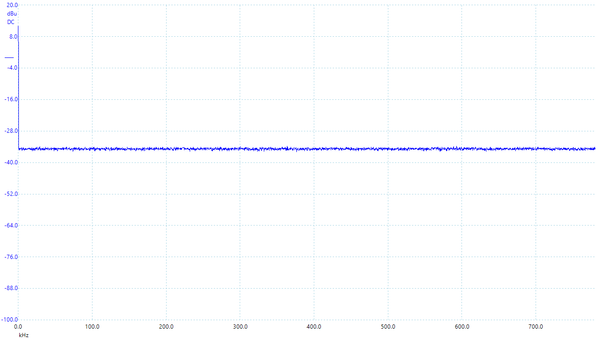
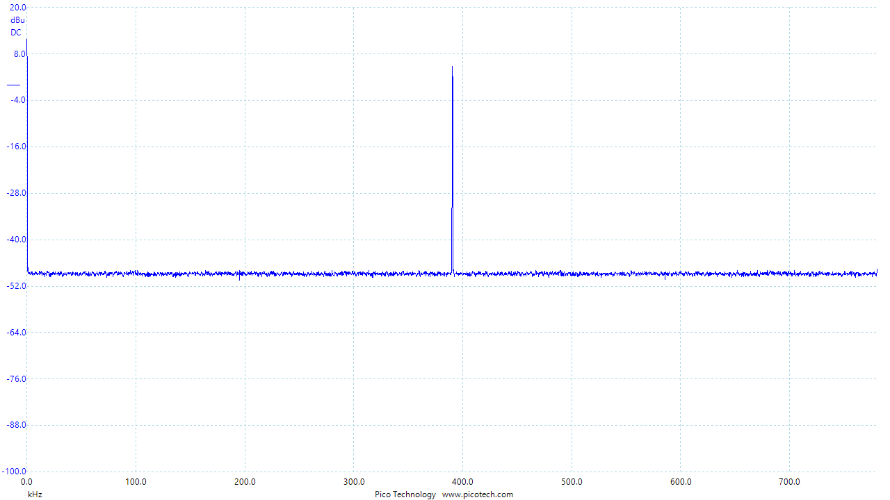
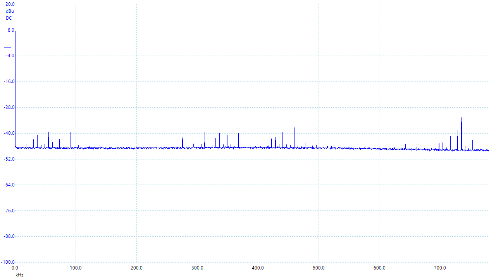
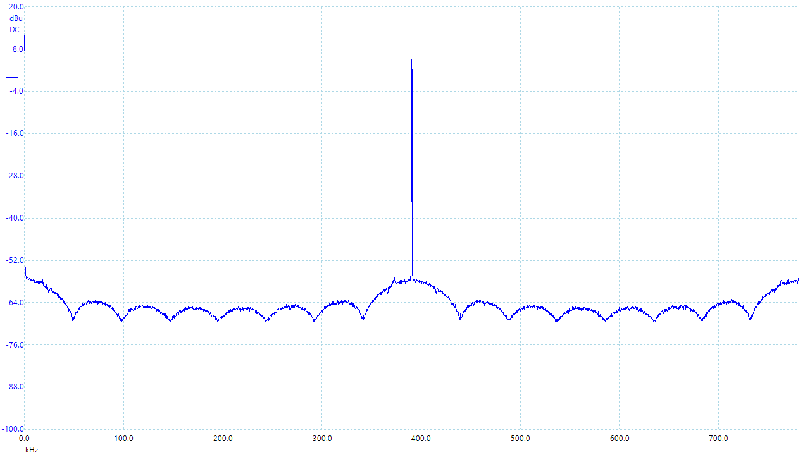
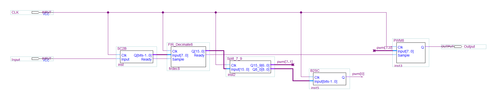
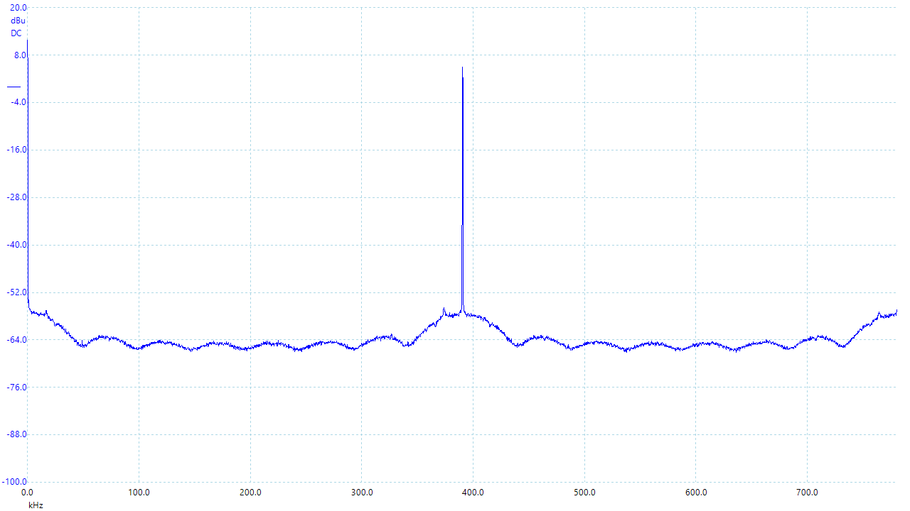

# Reducing the stochastic noise

Stochastic circuits produce very noisy signal. Stochastic zero is actually an oscullating square wave with 50/50% probability for 1s and 0s. This produces a white noise:

Because the noise is not correlated it can be reduced by averaging or filtering. However this will also reduce the signal sampling rate.
For example for 1-bit stochastic signal at 100Mhz we can perform 255 samples averaging/accumulation, which will give us the output signal at about 392kHz samplign rate, 8-bits depth.

An 8-bits DAC can be used then to convert 8-bits decimated signal to analog output. Alternatively we can use a pulse width modulation (PWM).

255-samples averaging decreases the noise level, and the PWM peak at ~392kHz can be filtered by a simpe RC-filter.

Another alternative to PWM is to use Sigma-Delta modulation that prodice pulse density modulated (PDM) output. This will not produce a single carrier peak but a broader spectrum:

We can do slightly better than averaging by designing an FIR filter that cuts at, say 24kHz. We'll need to perform a decimation/down sampling at a ration of about 2083 then to acheive 48kHz sampling rate output.
Making a low-pass FIR operating at 100Mhz with cut-off frequency at 24kHz is possible but it's going to be a very long filter with many taps. The good thing though that the input samples are either `0` or `1` so there is no multiplications to perform only additions.

Instead a decimation FIR can be applied on averaged 8-bit signal. This will require a multiplication operation in the FIR implementation though, but will make the filter significantly shorter.

Combining 255 bits averaging with FIR followed by 8-bit PWM, the high ferquency noise can be reduced even more:

Here we used only MSB 8 bits from 16-bits FIR output since constructing a 16-bits PWM is not possible (this would require extremely high clocking frequency). However we can still improve the dynamic range by applying the very same PDM to dither the very last bit of the 8-bits PWM:

This produces the following zero level noise spectrum:

